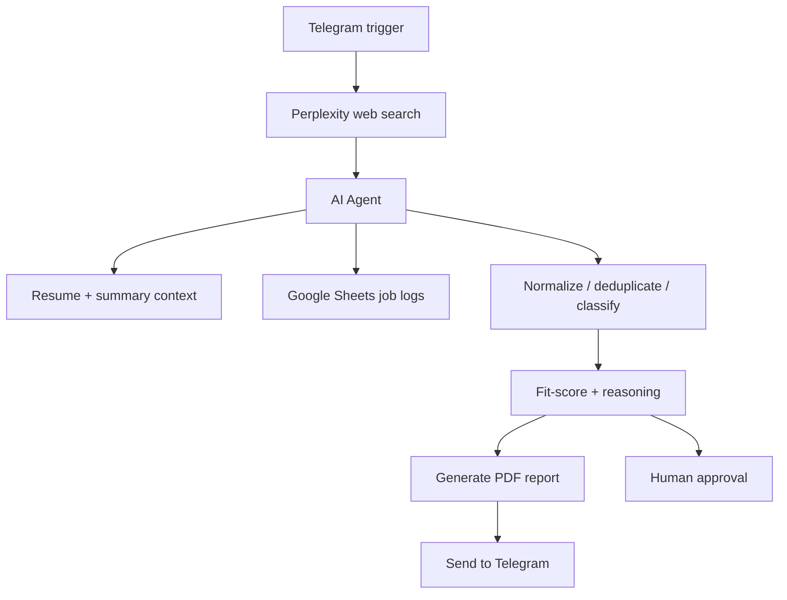
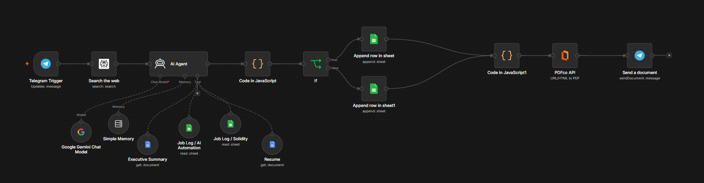
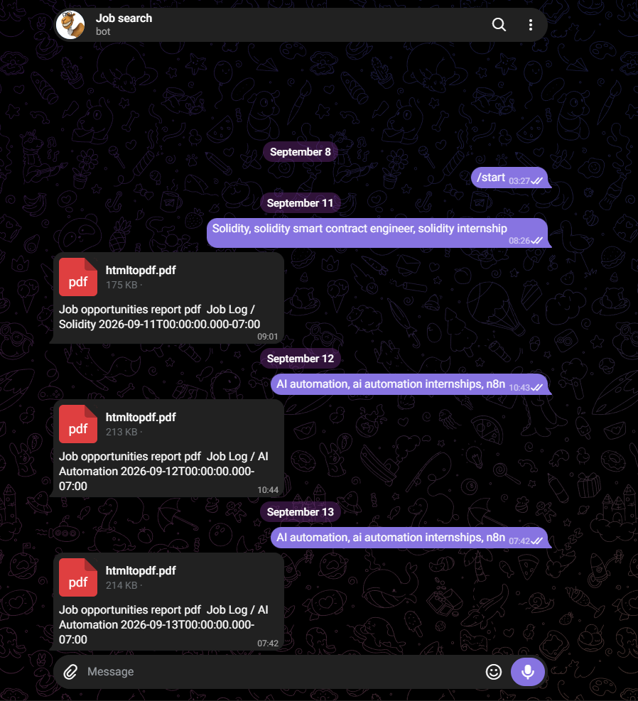

# AI Job Search Copilot

This project automates the process of discovering, filtering, and qualifying job opportunities with an AI-assisted workflow built in n8n. It combines web research, structured job extraction, duplicate handling, candidate matching, and user-facing reporting via Telegram and PDF delivery.

## What this workflow does

The system is designed to:

- monitor a Telegram-triggered job search request
- query the web for current openings
- normalize raw results into a predictable job schema
- remove duplicates across multiple sources or repeated listings
- classify jobs by domain such as AI Automation or Solidity
- compare job requirements against the candidate profile and resume
- keep only genuinely new and relevant opportunities
- push the final result to Google Sheets and send a formatted report to Telegram

## High-level flow

## Repository layout

- `workflow/` contains the exported n8n workflow JSON used as the implementation reference.
- `docs/` contains architecture, data model, and design notes.
- `examples/` includes representative inputs and output artifacts.
- `screenshots/` captures the workflow and Telegram reporting flow.
- `output/` contains generated artifacts such as PDFs and reports.

## Workflow overview

The actual implementation follows a research-to-selection pipeline:

1. A Telegram message initiates a search request.
2. Perplexity searches current job boards and company pages.
3. The AI agent extracts raw roles, filters for relevance, and checks prior job logs.
4. The results are normalized into a job record with metadata such as title, company, source, URL, location, remote status, and posting date.
5. Matching logic compares candidate experience and preferences with each listing.
6. New jobs are written into the relevant Google Sheet log and sent as a report to Telegram.

## Real implementation notes

This repository includes a sanitized workflow export from the live n8n automation. The workflow JSON reflects the actual structure used in production, including:

- Telegram Trigger
- Perplexity Search node
- AI Agent with Gemini model access
- Resume and executive summary document retrieval
- Google Sheets job log lookups for AI Automation and Solidity
- JavaScript code nodes for parsing and formatting output
- conditional branching to route jobs into the right storage sheet
- PDF generation and Telegram delivery

## Screenshots

## Core docs

- [docs/architecture.md](docs/architecture.md)
- [docs/data-model.md](docs/data-model.md)
- [docs/design-decisions.md](docs/design-decisions.md)
- [docs/duplicate-detection.md](docs/duplicate-detection.md)
- [docs/limitations.md](docs/limitations.md)

## Typical input and output

A request like “AI automation, ai automation internships, n8n” is converted into a targeted set of job search results. The pipeline then filters to jobs that are active, newly discovered, and relevant to the candidate profile. The final report is delivered in Telegram and saved as a PDF for review.

## Important implementation detail

The job agent does not simply forward raw search results. It explicitly performs:

- extraction of individual job records from the Perplexity output
- source verification
- duplicate checking against prior rows in Google Sheets
- role categorization (for example, AI Automation vs Solidity)
- fit evaluation against the candidate profile and resume
- final selection of only genuinely new jobs

This is what turns the workflow from a simple scraper into a job qualification pipeline.
