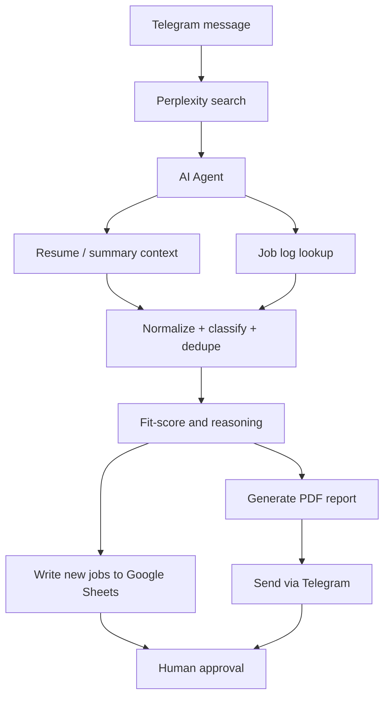

# Architecture

## System overview

The AI Job Search Copilot is a layered automation workflow that turns a user request into a structured, relevant, and reviewable shortlist of job opportunities.

The live implementation is built around n8n, Perplexity, Gemini, Google Sheets, and Telegram. The workflow is designed to reduce manual research, avoid duplicate postings, and surface only opportunities that are both fresh and relevant to the candidate.

## End-to-end pipeline

## Component responsibilities

### 1. User-triggered intake

The workflow begins when a user sends a job request via Telegram, such as a role title, skill keyword, or a request like “AI automation, ai automation internships, n8n”.

This message is used as the search prompt for the Perplexity node, which broadens the search over relevant job boards and company pages.

### 2. Web research and source collection

Perplexity acts as the research layer. It gathers current openings from public sources such as job boards, company pages, and related postings. This stage is intentionally broad because the downstream agent performs filtering and relevance checks.

### 3. AI reasoning and normalization layer

The core logic is the AI Agent node. It receives the raw research results and is instructed to:

- extract individual jobs from the search output
- identify missing fields such as remote status, salary, and job URL
- determine if a job is relevant
- decide whether it belongs to AI Automation or Solidity
- compare against prior entries in the job log
- evaluate fit against the candidate profile and resume

This stage is the most important decision engine in the workflow.

### 4. Data persistence and tracking

The workflow maintains separate Google Sheet job logs, including categories such as:

- Job Log / AI Automation
- Job Log / Solidity

This gives the system memory across runs and allows it to systematically reject duplicates and keep a consistent history of reviewed jobs.

### 5. Candidate memory and retrieval

The AI Agent is connected to:

- Simple Memory
- Resume document context
- Executive Summary / Extraction Summary context
- Job log sheets

This allows the agent to compare a job against the actual candidate profile rather than relying only on a generic prompt.

### 6. Output and delivery

After filtering and ranking, new jobs are:

- written into the appropriate Google Sheet
- transformed into a formatted report
- exported or rendered as a PDF
- transmitted via Telegram to the user

The workflow therefore supports both operational storage and human review.

## Design pattern

This architecture follows a classic retrieval-augmented workflow pattern:

- search: gather external market signal
- normalize: standardize raw job data
- enrich: add candidate-relevance context
- filter: retain only fresh and relevant roles
- store: persist in the job log
- deliver: present results to the user

## Actual implementation mapping

The sanitized workflow export in [workflow/ai-job-search-copilot.sanitized.json](../workflow/ai-job-search-copilot.sanitized.json) reflects the real architecture and includes these node types:

- Telegram Trigger
- Perplexity Search
- AI Agent (LangChain / Gemini)
- Google Docs tools for resume and summary retrieval
- Google Sheets tools for record lookup
- JavaScript code nodes for parsing and serialization
- If conditions for routing to a sheet
- PDF generation and Telegram send node

## Typical lifecycle

A role progresses through four main phases:

1. Discovery: raw job appears in Perplexity output.
2. Qualification: AI verifies title, source, relevance, and fit.
3. Persistence: the role is stored in the right log if it is genuinely new.
4. Reporting: the user receives a polished PDF or Telegram notification.

This keeps the results focused on high-signal opportunities rather than an unfiltered stream of raw listings.
